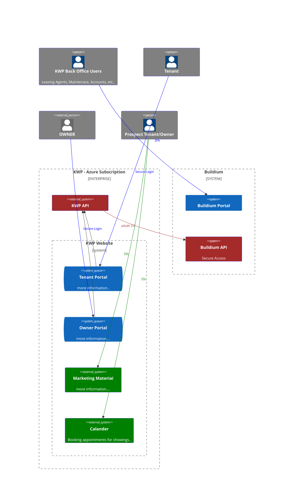

# Product Description
The KWP Website serves as an official online presence for KWP Property Management, offering tailored user portals for existing clients (owners and tenants) to manage properties, prospective tenants to explore listings, and potential owners to connect with sales contacts.

This site mainly serves three types of user or audience.
click [here](https://gridchef.atlassian.net/wiki/spaces/KWP/overview) for more information 

## Arhitecture
